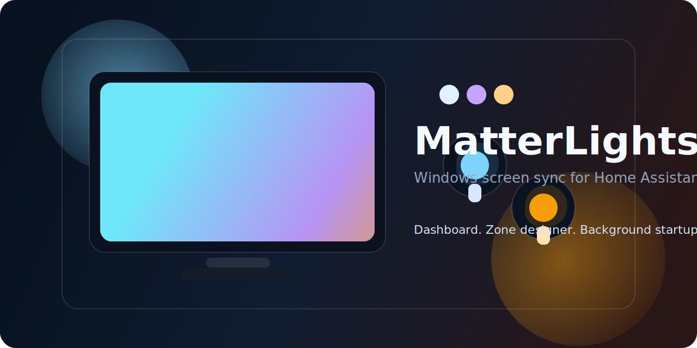
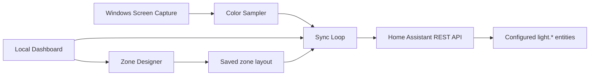

# MatterLights

[](https://www.microsoft.com/windows)
[](https://www.python.org/)
[](https://www.home-assistant.io/)
[](LICENSE)

MatterLights is a Windows desktop agent that samples your screen, computes a vivid representative color, and pushes that color to Home Assistant lights in near real time. It includes a local management dashboard, a visual zone designer, background startup scripts, and enough guardrails to run unattended on a gaming or media PC.

## Why this exists

This project targets a very specific setup:

- a Windows machine doing the screen capture locally
- Home Assistant as the control plane
- Matter or other light entities exposed in Home Assistant as normal `light.*` entities
- an ambient-lighting goal somewhere between whole-screen wash and zone-aware ambilight

Instead of adding another lighting server or streaming stack, MatterLights captures the screen directly on the PC and updates the exact Home Assistant entities you already use.

## Highlights

- Whole-screen, zoned, and shared-variant sync modes.
- OLED-aware dark detection so black scenes can drop the lights to off.
- Saturation and dominant-color tuning aimed at vivid ambient lighting rather than washed-out averages.
- Local dashboard at `http://127.0.0.1:8770` for status, logs, and service restarts.
- Zone designer at `http://127.0.0.1:8765` with screenshot overlays and a flash-selected-bulb action.
- Background helper scripts so sync, dashboard, and zone UI do not sit in visible terminal windows.
- Windows scheduled-task autostart for the sync loop and dashboard.

## Architecture



## Quick start

### Fastest path

If you want the shortest setup path from a fresh clone, run:

```powershell
powershell -ExecutionPolicy Bypass -File .\scripts\guided-setup.ps1
```

That guided script will:

- create the virtual environment if needed
- install the package
- prompt locally for your Home Assistant token
- discover `light.*` entities from Home Assistant
- write your selected configuration to `.env`
- optionally install Windows autostart
- optionally start the sync loop immediately

### Manual setup

```powershell
py -3.12 -m venv .venv
.\.venv\Scripts\Activate.ps1
python -m pip install --upgrade pip
python -m pip install -e .
Copy-Item .env.example .env
.\.venv\Scripts\python.exe -m matterlights.discover
```

Then edit `.env`, add your real Home Assistant token and light entities, and start the services you want:

```powershell
powershell -ExecutionPolicy Bypass -File .\scripts\start-sync.ps1
powershell -ExecutionPolicy Bypass -File .\scripts\start-dashboard.ps1
powershell -ExecutionPolicy Bypass -File .\scripts\start-zone-ui.ps1
```

Those helper scripts background themselves by default, so they do not keep a visible terminal window open.

## Local tools

### Screen sync

The sync loop is the long-running service that captures the screen and updates your lights.

```powershell
.\.venv\Scripts\python.exe -m matterlights
```

### Dashboard

The dashboard shows:

- sync task status
- dashboard task status
- Home Assistant reachability
- active configuration summary
- recent log output
- controls for starting, stopping, and restarting the sync loop or zone designer

Manual start:

```powershell
powershell -ExecutionPolicy Bypass -File .\scripts\start-dashboard.ps1
```

### Zone designer

The zone designer overlays editable capture regions on a screenshot of the selected display and lets you flash a bulb to identify it physically.

Manual start:

```powershell
powershell -ExecutionPolicy Bypass -File .\scripts\start-zone-ui.ps1
```

## Windows autostart

Install startup tasks for both the sync loop and dashboard:

```powershell
powershell -ExecutionPolicy Bypass -File .\scripts\install-autostart.ps1
```

Remove them later with:

```powershell
powershell -ExecutionPolicy Bypass -File .\scripts\remove-autostart.ps1
```

Installed tasks:

- `MatterLights Screen Sync`
- `MatterLights Dashboard`

Both are launched in hidden background hosts so they can run at logon without opening console windows.

## Configuration

The app reads `.env` first and falls back to shell environment variables. The most important settings are:

| Variable | Purpose |
| --- | --- |
| `HA_URL` | Base URL of Home Assistant. |
| `HA_TOKEN` | Home Assistant long-lived access token. |
| `HA_LIGHT_ENTITIES` | Comma-separated list of light entities to control. |
| `LIGHT_ZONE_LAYOUT` | Ordered zone names matched to `HA_LIGHT_ENTITIES`. |
| `COLOR_SYNC_MODE` | `zoned` or `shared-variant`. |
| `PRIMARY_LIGHT_ZONE_NAMES` | Primary bulbs used in shared-variant mode. |
| `SCREEN_CAPTURE_TARGET` | `primary`, `all`, or a 1-based monitor index. |
| `SYNC_INTERVAL_SECONDS` | Capture cadence. Lower is faster and heavier. |
| `MAX_PARALLEL_LIGHT_UPDATES` | Upper bound for concurrent Home Assistant light updates. |
| `BRIGHTNESS_FLOOR` | Minimum brightness on active updates. |
| `COLOR_BOOST` | Saturation multiplier applied after sampling. |
| `DARK_THRESHOLD` | Threshold below which lights can turn off. |
| `ZONE_UI_PORT` | Local port for the zone designer. |
| `DASHBOARD_PORT` | Local port for the management dashboard. |
| `LOG_PATH` | Optional log file path. Defaults to `%LOCALAPPDATA%\matterlights\matterlights.log`. |

Recognized zone names:

- `full`
- `top-left`, `top-center`, `top-right`
- `right-top`, `right-center`, `right-bottom`
- `bottom-right`, `bottom-center`, `bottom-left`
- `left-bottom`, `left-center`, `left-top`
- `center`

Example perimeter layout:

```dotenv
LIGHT_ZONE_LAYOUT=top-left,top-center,top-right,bottom-right,bottom-center,bottom-left
```

## Practical expectations

MatterLights looks best when it is used as ambient room lighting, not as a frame-perfect LED strip replacement.

- Home Assistant plus Matter bulbs are convenient, but they are not a low-latency streaming transport.
- The current tuning favors vivid, coherent ambience over literal per-pixel fidelity.
- Shared-variant mode is often the best match for ceiling lights or bulbs not physically attached to the display.
- If you need true sub-frame ambilight behavior for games, a direct streaming stack such as WLED DDP/UDP or Hue Entertainment is still the stronger transport.

## Troubleshooting

### Lights are not changing

- Confirm `HA_TOKEN` and `HA_LIGHT_ENTITIES` are correct.
- Run `.\.venv\Scripts\python.exe -m matterlights.discover` and verify the entity IDs exist.
- Open the dashboard and confirm Home Assistant is reachable.
- Check the log in the dashboard or at `%LOCALAPPDATA%\matterlights\matterlights.log`.

### Zone designer looks stale after code changes

- Kill any stray `python -m matterlights.zone_ui` processes.
- Restart the zone UI through the dashboard or `scripts\start-zone-ui.ps1`.

### Black scenes do not dim enough

- Lower `DARK_THRESHOLD` or increase `DARK_ACTIVE_RATIO_THRESHOLD`.
- Verify the screen content is actually dark in the sampled area and not surrounded by bright UI.

## Development

Local install:

```powershell
py -3.12 -m venv .venv
.\.venv\Scripts\Activate.ps1
python -m pip install -e .
```

Useful manual checks:

```powershell
.\.venv\Scripts\python.exe -m unittest discover -s tests -v
.\.venv\Scripts\python.exe -m compileall src tests
powershell -ExecutionPolicy Bypass -File .\scripts\install-autostart.ps1
```

## Repository layout

```text
src/matterlights/        Python package
scripts/                 Windows setup and runtime helpers
tests/                   Lightweight smoke and config tests
assets/                  README visuals
```

## License

This project is licensed under the MIT License. See [LICENSE](LICENSE).
