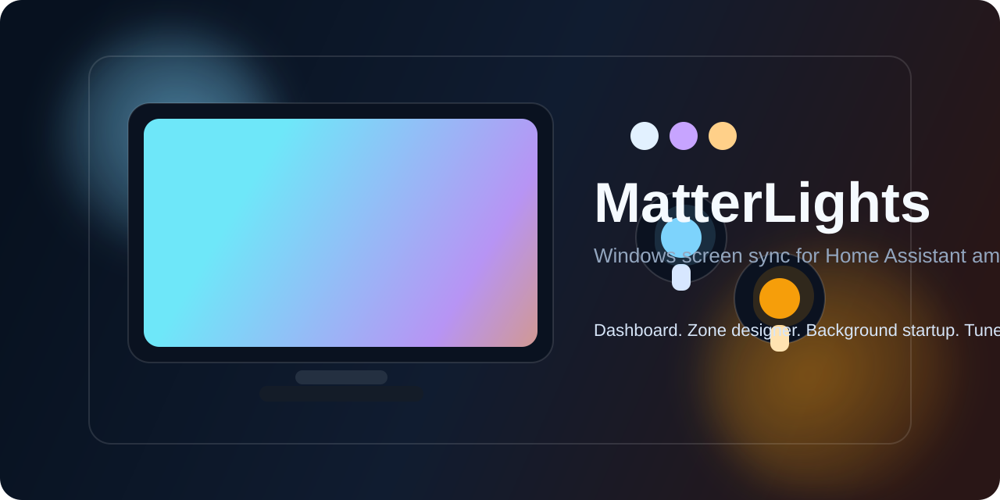
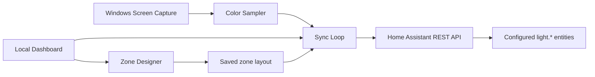

# MatterLights

[](https://www.microsoft.com/windows)
[](https://www.python.org/)
[](https://www.home-assistant.io/)
[](LICENSE)

MatterLights is a Windows desktop agent that samples your screen, computes a vivid representative color, and pushes that color to Home Assistant lights in near real time. It includes a local management dashboard, a visual zone designer, background startup scripts, and enough guardrails to run unattended on a gaming or media PC.

## Why this exists

This project targets a very specific setup:

- a Windows machine doing the screen capture locally
- Home Assistant as the control plane
- Matter or other light entities exposed in Home Assistant as normal `light.*` entities
- an ambient-lighting goal somewhere between whole-screen wash and zone-aware ambilight

Instead of adding another lighting server or streaming stack, MatterLights captures the screen directly on the PC and updates the exact Home Assistant entities you already use.

## Highlights

- Ambience engine that renders the screen's overall light as a weighted palette across near/far bulb groups, plus the older zoned and shared-variant modes.
- Autonomous (screen-driven) and custom (static color or looping pattern) playback modes, switchable live from the dashboard.
- OLED-aware dark detection so black scenes can drop the lights to off.
- Display-sleep aware: when the monitor powers off, the lights follow it off.
- Turns the lights off when Windows shuts down, so the room does not stay lit.
- Saturation and dominant-color tuning aimed at vivid ambient lighting rather than washed-out averages.
- Local dashboard at `http://127.0.0.1:8770` for status, logs, and service restarts.
- Zone designer at `http://127.0.0.1:8765` with screenshot overlays and a flash-selected-bulb action.
- Background helper scripts so sync, dashboard, and zone UI do not sit in visible terminal windows.
- Windows scheduled-task autostart for the sync loop and dashboard.

## Architecture


```mermaid
flowchart LR
	Screen[Windows Screen Capture] --> Sampler[Color Sampler]
	Sampler --> Sync[Sync Loop]
	Sync --> HA[Home Assistant REST API]
	HA --> Lights[Configured light.* entities]
	Dashboard[Local Dashboard] --> Sync
	Dashboard --> ZoneUI[Zone Designer]
	ZoneUI --> ZoneFile[Saved zone layout]
	ZoneFile --> Sync
```

## Quick start

### Fastest path

If you want the shortest setup path from a fresh clone, run:

```powershell
powershell -ExecutionPolicy Bypass -File .\scripts\guided-setup.ps1
```

That guided script will:

- create the virtual environment if needed
- install the package
- prompt locally for your Home Assistant token
- discover `light.*` entities from Home Assistant
- write your selected configuration to `.env`
- optionally install Windows autostart
- optionally start the sync loop immediately

### Manual setup

```powershell
py -3.12 -m venv .venv
.\.venv\Scripts\Activate.ps1
python -m pip install --upgrade pip
python -m pip install -e .
Copy-Item .env.example .env
.\.venv\Scripts\python.exe -m matterlights.discover
```

Then edit `.env`, add your real Home Assistant token and light entities, and start the services you want:

```powershell
powershell -ExecutionPolicy Bypass -File .\scripts\start-sync.ps1
powershell -ExecutionPolicy Bypass -File .\scripts\start-dashboard.ps1
powershell -ExecutionPolicy Bypass -File .\scripts\start-zone-ui.ps1
```

Those helper scripts background themselves by default, so they do not keep a visible terminal window open.

## Local tools

### Screen sync

The sync loop is the long-running service that captures the screen and updates your lights.

```powershell
.\.venv\Scripts\python.exe -m matterlights
```

### Dashboard

The dashboard shows:

- sync task status
- dashboard task status
- Home Assistant reachability
- active configuration summary
- recent log output
- controls for starting, stopping, and restarting the sync loop or zone designer

Manual start:

```powershell
powershell -ExecutionPolicy Bypass -File .\scripts\start-dashboard.ps1
```

### Zone designer

The zone designer overlays editable capture regions on a screenshot of the selected display and lets you flash a bulb to identify it physically.

Manual start:

```powershell
powershell -ExecutionPolicy Bypass -File .\scripts\start-zone-ui.ps1
```

## Ambience mode (recommended)

`COLOR_SYNC_MODE=ambience` replaces "what is the strongest color on screen?" with "if the screen were the only light source in the room, what would the room look like?" The older dominant-color engines weight vivid pixels so heavily that a small bright-red patch on an otherwise muted frame paints the whole room red; ambience mode weights colors by the light they actually contribute — screen area times brightness, with only a mild lift for saturation — so that patch earns, at most, a single accent bulb.

Each frame is clustered into a small weighted palette, then rendered by two physical light groups:

- **Near group** — the bulbs beside the screen. They carry the palette's strongest components: the screen's glow.
- **Far group** — the bulbs deeper in the room. Their slots are shared out across the palette in proportion to weight, so their additive blend reproduces the frame's overall balance. A frame that averages to a muddy brown is rendered as its live components — some amber, some teal — whose mix *is* that brown, instead of six bulbs all showing the same flat average.

Bulb assignments are matched against what each bulb showed last frame, so a near-tie flip in the palette does not make two bulbs trade colors.

Set the near group with `AMBIENCE_NEAR_LIGHTS` (comma-separated entity IDs). If unset, the `PRIMARY_LIGHT_ZONE_NAMES` mapping is reused, and failing that, the first two entities. Zones and the zone designer are not used in this mode.

## Playback modes

MatterLights has two playback modes, switchable live from the **Playback Mode** panel on the dashboard. The choice is written to `CONTROL_STATE_FILE` and the running sync loop picks it up automatically (no restart needed).

- **Autonomous** — the default screen-driven behavior described above.
- **Custom** — ignores the screen and drives every light from either a single static color or a looping multi-color pattern. Useful as mood lighting when you are not gaming or watching anything.

### Color vs. white

Every custom color — the solid color and each pattern step — can be either an **RGB color** or a **tunable white** color temperature (for bulbs that support white mode, like the Ledvance Matter PAR16). Pick **Color** for a hue, or **White** for a Kelvin value (warm ↔ cool); brightness applies to both. You can even mix them in one pattern, e.g. fade from a warm white into a color and back.

### Patterns

A pattern is an ordered list of colors that loops. Each color has two timings:

- **Hold** — how many seconds to stay on that color.
- **Fade in** — how many seconds the previous color takes to fade into this one. The fade uses Home Assistant's `transition` service parameter.

> **Fades are off by default.** Many Matter bulbs (including the Ledvance PAR16) lock up when sent a `transition` command and have to be power-cycled, so pattern fades are capped by `MAX_PATTERN_TRANSITION_SECONDS` (default `0`, meaning colors snap). If your bulbs are known to handle transitions, set it above `0` in `.env` to enable fades.

The total loop length is the sum of every hold and fade. For example, the dashboard's default 10-second loop is:

| Color | Hold | Fade in |
| --- | --- | --- |
| Red | 3s | 0s (snaps in) |
| Blue | 4s | 1s |
| Yellow | 0s | 2s |

That is: red for 3s → fade to blue over 1s → blue for 4s → fade to yellow over 2s → loop back to red. The editor shows a live, animated preview of the loop and the computed loop length while you arrange the colors.

### Choosing the capture screen

The **Capture Screen** panel on the dashboard picks which screen autonomous mode samples. It draws your monitors in their real desktop arrangement — click one to select it, or use the dropdown. **Preview** grabs a downscaled thumbnail so you can confirm you picked the right physical screen.

Options are your attached screens, plus:

- **Follow .env default** — use `SCREEN_CAPTURE_TARGET` (the original behavior).
- **Primary screen** — whichever screen Windows currently calls primary.
- **All screens combined** — the whole virtual desktop as one image.

The choice is stored in `CONTROL_STATE_FILE`, so it applies immediately without restarting the sync loop, and the zone designer follows it too. If the selected screen is later disconnected or powered off, the sync loop logs a warning and falls back to `SCREEN_CAPTURE_TARGET` until it returns.

### Screen sleep

### Shutdown

When Windows shuts down, restarts, or logs off, the lights are turned off on the way out, so you are not left with a lit room after the PC is gone. Set `TURN_OFF_ON_SHUTDOWN=false` to leave them as they were.

Windows only allows a few seconds for this, so it is deliberately a single grouped Home Assistant request. If Home Assistant is unreachable at that moment the shutdown still proceeds normally — it is never blocked.

### Screen sleep

When the monitor goes to sleep, the lights turn off in both modes. This is the same idea as OLED dark detection, but it also covers custom mode and is driven by the actual Windows display power state rather than screen content. Set `RESPECT_DISPLAY_SLEEP=false` to keep custom colors on while the screen sleeps.

## Windows autostart

Install startup tasks for both the sync loop and dashboard:

```powershell
powershell -ExecutionPolicy Bypass -File .\scripts\install-autostart.ps1
```

Remove them later with:

```powershell
powershell -ExecutionPolicy Bypass -File .\scripts\remove-autostart.ps1
```

Installed tasks:

- `MatterLights Screen Sync`
- `MatterLights Dashboard`

Both are launched in hidden background hosts so they can run at logon without opening console windows.

## Configuration

The app reads `.env` first and falls back to shell environment variables. The most important settings are:

| Variable | Purpose |
| --- | --- |
| `HA_URL` | Base URL of Home Assistant. |
| `HA_TOKEN` | Home Assistant long-lived access token. |
| `HA_LIGHT_ENTITIES` | Comma-separated list of light entities to control. |
| `LIGHT_ZONE_LAYOUT` | Ordered zone names matched to `HA_LIGHT_ENTITIES`. |
| `CONTROL_STATE_FILE` | Where the playback mode (autonomous/custom) and pattern are stored. |
| `RESPECT_DISPLAY_SLEEP` | `true` to turn lights off when the monitor sleeps. |
| `TURN_OFF_ON_SHUTDOWN` | `true` to turn lights off when Windows shuts down, restarts, or logs off. |
| `MAX_PATTERN_TRANSITION_SECONDS` | Caps custom pattern fades; `0` snaps (safe for Matter bulbs that freeze on transitions). |
| `COLOR_SYNC_MODE` | `ambience` (recommended), `zoned`, or `shared-variant`. |
| `AMBIENCE_NEAR_LIGHTS` | Entity IDs of the bulbs beside the screen (ambience mode's near group). |
| `PRIMARY_LIGHT_ZONE_NAMES` | Primary bulbs used in shared-variant mode. |
| `SCREEN_CAPTURE_TARGET` | Default screen: `primary`, `all`, or a 1-based monitor index. Overridable live from the dashboard. |
| `SYNC_INTERVAL_SECONDS` | Capture cadence. Lower is faster and heavier. |
| `MAX_PARALLEL_LIGHT_UPDATES` | Upper bound for concurrent Home Assistant light updates. |
| `BRIGHTNESS_FLOOR` | Minimum brightness on active updates. |
| `COLOR_BOOST` | Saturation multiplier applied after sampling. |
| `DARK_THRESHOLD` | Threshold below which lights can turn off. |
| `ZONE_UI_PORT` | Local port for the zone designer. |
| `DASHBOARD_PORT` | Local port for the management dashboard. |
| `LOG_PATH` | Optional log file path. Defaults to `%LOCALAPPDATA%\matterlights\matterlights.log`. |

Recognized zone names:

- `full`
- `top-left`, `top-center`, `top-right`
- `right-top`, `right-center`, `right-bottom`
- `bottom-right`, `bottom-center`, `bottom-left`
- `left-bottom`, `left-center`, `left-top`
- `center`

Example perimeter layout:

```dotenv
LIGHT_ZONE_LAYOUT=top-left,top-center,top-right,bottom-right,bottom-center,bottom-left
```

## Practical expectations

MatterLights looks best when it is used as ambient room lighting, not as a frame-perfect LED strip replacement.

- Home Assistant plus Matter bulbs are convenient, but they are not a low-latency streaming transport.
- The current tuning favors vivid, coherent ambience over literal per-pixel fidelity.
- Shared-variant mode is often the best match for ceiling lights or bulbs not physically attached to the display.
- If you need true sub-frame ambilight behavior for games, a direct streaming stack such as WLED DDP/UDP or Hue Entertainment is still the stronger transport.

## Troubleshooting

### Lights are not changing

- Confirm `HA_TOKEN` and `HA_LIGHT_ENTITIES` are correct.
- Run `.\.venv\Scripts\python.exe -m matterlights.discover` and verify the entity IDs exist.
- Open the dashboard and confirm Home Assistant is reachable.
- Check the log in the dashboard or at `%LOCALAPPDATA%\matterlights\matterlights.log`.

### Zone designer looks stale after code changes

- Kill any stray `python -m matterlights.zone_ui` processes.
- Restart the zone UI through the dashboard or `scripts\start-zone-ui.ps1`.

### Black scenes do not dim enough

- Lower `DARK_THRESHOLD` or increase `DARK_ACTIVE_RATIO_THRESHOLD`.
- Verify the screen content is actually dark in the sampled area and not surrounded by bright UI.

## Development

Local install:

```powershell
py -3.12 -m venv .venv
.\.venv\Scripts\Activate.ps1
python -m pip install -e .
```

Useful manual checks:

```powershell
.\.venv\Scripts\python.exe -m unittest discover -s tests -v
.\.venv\Scripts\python.exe -m compileall src tests
powershell -ExecutionPolicy Bypass -File .\scripts\install-autostart.ps1
```

## Repository layout

```text
src/matterlights/        Python package
scripts/                 Windows setup and runtime helpers
tests/                   Lightweight smoke and config tests
assets/                  README visuals
```

## License

This project is licensed under the MIT License. See [LICENSE](LICENSE).
