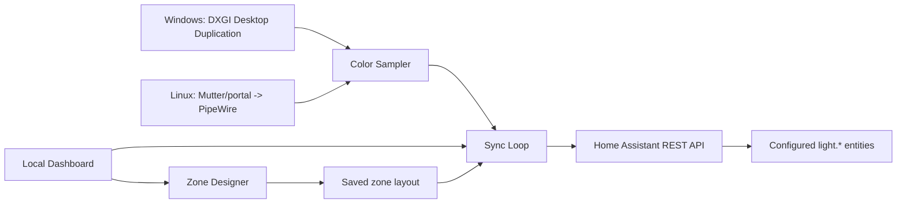

# MatterLights

[](https://www.microsoft.com/windows)
[](https://www.kernel.org/)
[](https://www.python.org/)
[](https://www.home-assistant.io/)
[](LICENSE)

MatterLights is a desktop agent for **Windows and Linux** that samples your screen, computes a vivid representative color, and pushes that color to Home Assistant lights in near real time. It includes a local management dashboard, a visual zone designer, autostart integration for both platforms, and enough guardrails to run unattended on a gaming or media PC.

## Why this exists

This project targets a very specific setup:

- a Windows or Linux machine doing the screen capture locally
- Home Assistant as the control plane
- Matter or other light entities exposed in Home Assistant as normal `light.*` entities
- an ambient-lighting goal somewhere between whole-screen wash and zone-aware ambilight

Instead of adding another lighting server or streaming stack, MatterLights captures the screen directly on the PC and updates the exact Home Assistant entities you already use.

## Highlights

- Ambience engine that renders the screen's overall light as a weighted palette across near/far bulb groups, plus the older zoned and shared-variant modes.
- Autonomous (screen-driven) and custom (static color or looping pattern) playback modes, switchable live from the dashboard.
- OLED-aware dark detection so black scenes can drop the lights to off.
- Display-sleep aware: when the monitor powers off, the lights follow it off.
- Turns the lights off when the machine shuts down, so the room does not stay lit.
- Saturation and dominant-color tuning aimed at vivid ambient lighting rather than washed-out averages.
- Local dashboard at `http://127.0.0.1:8770` for status, logs, and service restarts.
- Zone designer at `http://127.0.0.1:8765` with screenshot overlays and a flash-selected-bulb action.
- Background helper scripts so sync, dashboard, and zone UI do not sit in visible terminal windows.
- One color engine on both platforms: capture hands over BGRx bytes and every color decision downstream is identical.
- Autostart for the sync loop and dashboard: Windows scheduled tasks, or systemd user units on Linux.

## Architecture


```mermaid
flowchart LR
	Win[Windows: DXGI Desktop Duplication] --> Sampler[Color Sampler]
	Lin[Linux: Mutter/portal -> PipeWire] --> Sampler
	Sampler --> Sync[Sync Loop]
	Sync --> HA[Home Assistant REST API]
	HA --> Lights[Configured light.* entities]
	Dashboard[Local Dashboard] --> Sync
	Dashboard --> ZoneUI[Zone Designer]
	ZoneUI --> ZoneFile[Saved zone layout]
	ZoneFile --> Sync
```

## Quick start

MatterLights runs the same way on both platforms; only setup differs.

### Linux (GNOME Wayland)

```bash
scripts/linux/install.sh
```

That script creates the virtualenv, installs the package, checks Home Assistant,
and offers to install the systemd units. Run it once, put your token in the
`.env` it creates, then run it again.

**It will refuse a conda interpreter, on purpose.** See
[Linux setup](#linux-setup) below for why, and for the system packages you need.

### Windows

#### Fastest path

If you want the shortest setup path from a fresh clone, run:

```powershell
powershell -ExecutionPolicy Bypass -File .\scripts\guided-setup.ps1
```

That guided script will:

- create the virtual environment if needed
- install the package
- prompt locally for your Home Assistant token
- discover `light.*` entities from Home Assistant
- write your selected configuration to `.env`
- optionally install Windows autostart
- optionally start the sync loop immediately

#### Manual setup

```powershell
py -3.12 -m venv .venv
.\.venv\Scripts\Activate.ps1
python -m pip install --upgrade pip
python -m pip install -e .
Copy-Item .env.example .env
.\.venv\Scripts\python.exe -m matterlights.discover
```

Then edit `.env`, add your real Home Assistant token and light entities, and start the services you want:

```powershell
powershell -ExecutionPolicy Bypass -File .\scripts\start-sync.ps1
powershell -ExecutionPolicy Bypass -File .\scripts\start-dashboard.ps1
powershell -ExecutionPolicy Bypass -File .\scripts\start-zone-ui.ps1
```

Those helper scripts background themselves by default, so they do not keep a visible terminal window open.


## Linux setup

### What it needs, and why some of it is not a pip dependency

MatterLights captures the screen on Linux through **PipeWire**, driven by
**GStreamer** and **PyGObject**. Those are distribution packages, not pip
packages — `pip install PyGObject` needs meson plus cairo and glib headers and
usually fails. They are therefore deliberately *not* declared in
`pyproject.toml`, and the installer checks for them instead.

```bash
# Arch / Garuda
sudo pacman -S --needed python-gobject gstreamer gst-plugins-base gst-plugin-pipewire

# Debian / Ubuntu
sudo apt install python3-gi gstreamer1.0-pipewire gstreamer1.0-plugins-base
```

### ⚠️ The virtualenv must come from the system Python

Because those bindings are system packages, the virtualenv has to be created
with `--system-site-packages` **and from the distribution interpreter** — a venv
inherits the site-packages of whichever Python created it.

```bash
/usr/bin/python3 -m venv --system-site-packages .venv
```

**`python3` on your PATH may not be that interpreter.** If you have miniconda,
pyenv or similar, `python3` is theirs, and a venv built from it has its own
site-packages with no `gi` in them. The venv then comes up looking perfectly
healthy and dies at the first capture. `scripts/linux/install.sh` refuses a
conda interpreter outright for exactly this reason; override the choice with
`MATTERLIGHTS_PYTHON=/path/to/python3` if you know better.

### Why X11 screen capture cannot work here

On a Wayland session, X11 capture returns a **completely black frame**. This is
not a bug in `mss` or in any other X11 grabber, and no configuration fixes it:
XWayland is a real X server and knows the monitor layout the compositor tells
it, but native Wayland windows are never composited into the X11 root window, so
there is nothing in the buffer to read. Geometry is metadata; pixels are
content, and XWayland has only the first.

That is why capture goes through the compositor instead.

### The two capture backends

| Backend | When it is used | Consent dialog |
| --- | --- | --- |
| `org.gnome.Mutter.ScreenCast` | GNOME sessions | none, ever |
| `org.freedesktop.portal.ScreenCast` | everything else | once, then remembered via a restore token |

The choice is made by asking whether `org.gnome.Mutter.ScreenCast` exists on the
session bus — that is, *is this GNOME?* — and **never** by catching an error
from it. A Mutter call that fails means GNOME answered badly (a race with
`gnome-shell` starting, a dropped D-Bus call), and the right response is to
retry. Falling back to the portal there would raise a consent dialog that an
autostarted service meets at login with nobody present to click it, and the sync
loop would sit there apparently running while driving nothing.

On the portal path, **the user picks the screen in the dialog**, so
`SCREEN_CAPTURE_TARGET` and the dashboard's Capture Screen panel cannot select
it. The dashboard says so rather than offering a control that does nothing.

### ⚠️ Capture uses `RecordArea` for every target, including single monitors

`RecordMonitor` looks like the obvious call for "record this one screen". It is
not used, because on the development machine's primary display — a 3840×2160
panel at **240 Hz with variable refresh rate (VRR)** — it delivered **no frames
at all**, while `RecordArea` over that monitor's identical rectangle delivered a
frame in under a tenth of a second. The two 60 Hz outputs worked either way, so
VRR is the only property that differs, though causation is unconfirmed. It is
also intermittent: the same call succeeded earlier the same day.

There is deliberately no "try `RecordMonitor` first" fast path. A capture
backend that quietly stops working once a game starts is worse than useless,
because a gaming monitor is the only screen anyone wants this program to sync to.

### Linux autostart

`scripts/linux/install.sh` offers to install three systemd units:

| Unit | Scope | Purpose |
| --- | --- | --- |
| `matterlights-sync.service` | user | the sync loop |
| `matterlights-dashboard.service` | user | the dashboard |
| `matterlights-lights-off.service` | **system** | turns the lights off at shutdown |

```bash
systemctl --user status matterlights-sync
journalctl --user -u matterlights-sync -f
systemctl --user restart matterlights-sync
scripts/linux/uninstall.sh          # removes the units, keeps .env and .venv
```

⚠️ **The user units are `PartOf=graphical-session.target`, and that matters.**
If you have lingering enabled (`loginctl enable-linger`), a user unit bound to
`default.target` would survive logout — with the compositor gone, capture dies
and the lights stay stuck on their last color. `PartOf` makes logging out stop
the unit, which sends `SIGTERM`, which turns the lights off.

⚠️ **The lights-off unit is a system unit, not a user one**, for the same reason
the Windows equivalent must run as SYSTEM: the thing being torn down cannot be
the thing that reports the teardown. Its `ExecStart` does nothing; all the work
is in `ExecStop`, ordered `After=network-online.target` — systemd stops units in
reverse dependency order, so that is what makes it run while the network is
still up.

## Local tools

### Screen sync

The sync loop is the long-running service that captures the screen and updates your lights.

```powershell
.\.venv\Scripts\python.exe -m matterlights     # Windows
```
```bash
.venv/bin/python -m matterlights                # Linux
systemctl --user start matterlights-sync        # or, once installed
```

### Dashboard

The dashboard shows:

- sync task status
- dashboard task status
- Home Assistant reachability
- active configuration summary
- recent log output
- controls for starting, stopping, and restarting the sync loop or zone designer

⚠️ **On Windows, "Restart" waits for the task to actually stop before starting it.**
`Stop-ScheduledTask` is asynchronous — it signals termination and returns while the
process is still alive. Starting the task again immediately launches a second sync
loop, which finds the single-instance mutex still held and exits. The service is then
left *stopped*, while Task Scheduler records `LastTaskResult: 0` and the dashboard
reports success. So the restart polls the task state until it stops being Running --
up to 40 polls, roughly 10-30 seconds of wall clock, since each poll spawns PowerShell.
`systemctl restart` is synchronous, so the Linux backend needs none of this.

Manual start:

```powershell
powershell -ExecutionPolicy Bypass -File .\scripts\start-dashboard.ps1   # Windows
```
```bash
systemctl --user start matterlights-dashboard                            # Linux
```

### Zone designer

The zone designer overlays editable capture regions on a screenshot of the selected display and lets you flash a bulb to identify it physically.

Manual start:

```powershell
powershell -ExecutionPolicy Bypass -File .\scripts\start-zone-ui.ps1   # Windows
```
```bash
.venv/bin/python -m matterlights.zone_ui                                # Linux
```

On Linux the dashboard starts the zone designer as a transient systemd unit
(`matterlights-zone-ui.service`) rather than a child process, so restarting the
dashboard does not kill it.

## Ambience mode (recommended)

`COLOR_SYNC_MODE=ambience` replaces "what is the strongest color on screen?" with "if the screen were the only light source in the room, what would the room look like?" The older dominant-color engines weight vivid pixels so heavily that a small bright-red patch on an otherwise muted frame paints the whole room red; ambience mode weights colors by the light they actually contribute — screen area times brightness, with only a mild lift for saturation — so that patch earns, at most, a single accent bulb.

Each frame is clustered into a small weighted palette, then rendered by two physical light groups:

- **Near group** — the bulbs beside the screen. They carry the palette's strongest components: the screen's glow.
- **Far group** — the bulbs deeper in the room. Their slots are shared out across the palette in proportion to weight, so their additive blend reproduces the frame's overall balance. A frame that averages to a muddy brown is rendered as its live components — some amber, some teal — whose mix *is* that brown, instead of six bulbs all showing the same flat average.

Bulb assignments are matched against what each bulb showed last frame, so a near-tie flip in the palette does not make two bulbs trade colors.

Set the near group with `AMBIENCE_NEAR_LIGHTS` (comma-separated entity IDs). If unset, the `PRIMARY_LIGHT_ZONE_NAMES` mapping is reused, and failing that, the first two entities. Zones and the zone designer are not used in this mode.

## Playback modes

MatterLights has two playback modes, switchable live from the **Playback Mode** panel on the dashboard. The choice is written to `CONTROL_STATE_FILE` and the running sync loop picks it up automatically (no restart needed).

- **Autonomous** — the default screen-driven behavior described above.
- **Custom** — ignores the screen and drives every light from either a single static color or a looping multi-color pattern. Useful as mood lighting when you are not gaming or watching anything.

### Color vs. white

Every custom color — the solid color and each pattern step — can be either an **RGB color** or a **tunable white** color temperature (for bulbs that support white mode, like the Ledvance Matter PAR16). Pick **Color** for a hue, or **White** for a Kelvin value (warm ↔ cool); brightness applies to both. You can even mix them in one pattern, e.g. fade from a warm white into a color and back.

### Patterns

A pattern is an ordered list of colors that loops. Each color has two timings:

- **Hold** — how many seconds to stay on that color.
- **Fade in** — how many seconds the previous color takes to fade into this one. The fade uses Home Assistant's `transition` service parameter.

> **Fades are off by default.** Many Matter bulbs (including the Ledvance PAR16) lock up when sent a `transition` command and have to be power-cycled, so pattern fades are capped by `MAX_PATTERN_TRANSITION_SECONDS` (default `0`, meaning colors snap). If your bulbs are known to handle transitions, set it above `0` in `.env` to enable fades.

The total loop length is the sum of every hold and fade. For example, the dashboard's default 10-second loop is:

| Color | Hold | Fade in |
| --- | --- | --- |
| Red | 3s | 0s (snaps in) |
| Blue | 4s | 1s |
| Yellow | 0s | 2s |

That is: red for 3s → fade to blue over 1s → blue for 4s → fade to yellow over 2s → loop back to red. The editor shows a live, animated preview of the loop and the computed loop length while you arrange the colors.

### Choosing the capture screen

The **Capture Screen** panel on the dashboard picks which screen autonomous mode samples. It draws your monitors in their real desktop arrangement — click one to select it, or use the dropdown. **Preview** grabs a downscaled thumbnail so you can confirm you picked the right physical screen.

Options are your attached screens, plus:

- **Follow .env default** — use `SCREEN_CAPTURE_TARGET` (the original behavior).
- **Primary screen** — whichever screen Windows currently calls primary.
- **All screens combined** — the whole virtual desktop as one image.

The choice is stored in `CONTROL_STATE_FILE`, so it applies immediately without restarting the sync loop, and the zone designer follows it too. If the selected screen is later disconnected or powered off, the sync loop logs a warning and falls back to `SCREEN_CAPTURE_TARGET` until it returns.

### Screen sleep

When the monitor goes to sleep, the lights turn off in both modes. This is the same idea as OLED dark detection, but it also covers custom mode and is driven by the actual display power state rather than screen content — `GUID_CONSOLE_DISPLAY_STATE` on Windows, and `org.gnome.Mutter.DisplayConfig`'s `PowerSaveMode` on Linux (falling back to polling `/sys/class/drm/*/dpms`, which needs no compositor at all).

On Linux, a `PowerSaveMode` of `-1` means "Mutter does not know" and is deliberately treated as **on**. Reading an unknown state as off would turn the lights out in a room somebody is sitting in. Set `RESPECT_DISPLAY_SLEEP=false` to keep custom colors on while the screen sleeps.

While the screen is asleep the sync loop keeps sweeping: any bulb that was unavailable when the screen went to sleep, or that only came back afterwards, is still turned off on a later tick. The lights come back when the display wakes.

### Shutdown, restart and logoff

Three independent layers turn the lights off when the PC goes away, on both
platforms. They overlap on purpose — the first is the fastest but least
reliable, the last is the slowest but cannot be bypassed.

**The same lesson applies on both systems, in mirror image.** On Windows an
ordinary interactive scheduled task fires on shutdown and then dies with
`0xC000026B` — the session is already being destroyed, so no process can start
in it — and only a task running as **SYSTEM**, in session 0, actually works. The
Linux equivalent is exact: a **user** unit dies with the session, so it cannot be
the thing that reports the session dying. That is why the Linux layer is a
*system* unit. In both cases: the thing being torn down cannot be the thing that
reports the teardown.

#### On Linux

| Layer | Mechanism | Covers | Latency |
| --- | --- | --- | --- |
| System unit **(the one that works)** | `matterlights-lights-off.service`, `ExecStop=python -m matterlights.lights_off`, ordered `After=network-online.target` | Shutdown and reboot | Under a second |
| In-process hook | `SIGTERM` / `SIGINT` handler in the sync loop | `systemctl --user stop`, **logout** (the unit is `PartOf=graphical-session.target`), Ctrl-C | Immediate |
| Home Assistant | Automation watching a heartbeat entity go stale | Everything, including a crash, a hard reset, or the power going out | ~3 minutes |

The in-process layer is considerably more trustworthy on Linux than on Windows,
because `systemctl stop` and a logout that stops a `PartOf=` unit both send a
real `SIGTERM` and wait `TimeoutStopSec` for it. It still does not cover a
shutdown, because systemd stops the whole user manager.

The signal handler **chains to the previous handler** rather than swallowing the
signal. Turning the lights off must not turn MatterLights into a program that
ignores `SIGTERM`; systemd would then wait out `TimeoutStopSec` and `SIGKILL` it
at every single logout and shutdown.

Install and test it without rebooting:

```bash
sudo systemctl enable --now matterlights-lights-off.service
sudo systemctl stop matterlights-lights-off.service    # runs ExecStop: lights go off
sudo systemctl start matterlights-lights-off.service   # re-arm for the next shutdown
```

#### On Windows

| Layer | Mechanism | Covers | Latency |
| --- | --- | --- | --- |
| Scheduled task **(the one that works)** | Task Scheduler trigger on System event **1074**, running `python -m matterlights.lights_off` **as SYSTEM** | Shutdown and restart | Under a second |
| In-process hook | `WM_QUERYENDSESSION` to a hidden top-level window in the sync loop | Logoff, and any session end where the process is still alive to be told — **not** an ordinary `shutdown /r /t 0` | Immediate |
| Home Assistant | Automation watching a heartbeat entity go stale | Everything, including a crash, a hard reset, or the power going out. Does **not** cover a normal reboot, which completes well inside the staleness window | ~3 minutes |

Set `TURN_OFF_ON_SHUTDOWN=false` to disable the in-process hook. The shutdown is never blocked: the hook always tells Windows it may proceed, and a Home Assistant that is unreachable at that moment cannot delay it.

**Why the scheduled task must run as SYSTEM.** This is the whole ballgame, and it is not optional. Registered as an ordinary interactive task, it triggers correctly — one second after event 1074 — and then dies with `0xC000026B`, `STATUS_DLL_INIT_FAILED_LOGOFF`: *"the application failed to initialize because the window station is shutting down."* By the time event 1074 is written, the interactive session is already being destroyed and Windows will not start a new process in it. SYSTEM runs in session 0, which is still alive, so the process actually starts. The helper needs nothing from the user session: the token and the absolute `LOG_PATH` both come from `.env`.

**Why the in-process hook is not enough.** Measured across eight days and eight session ends, its callback fired *zero* times — while its window was demonstrably alive and answering `WM_QUERYENDSESSION` sent from another process in 5 ms. The same `0xC000026B` explains it: the interactive session is torn down abruptly rather than being given the usual "please close" conversation, which is what `shutdown /r /t 0` asks for. Moving the hook from `WM_ENDSESSION` to `WM_QUERYENDSESSION` did not change this — a real reboot afterwards still produced no log line. It is kept because it costs nothing and does work for a plain logoff, but **do not rely on it**; the SYSTEM task is the layer that actually turns the lights off.

Install the scheduled task once, **from an elevated PowerShell** (registering a SYSTEM task requires it):

```powershell
powershell -ExecutionPolicy Bypass -File .\scripts\install-shutdown-task.ps1
```

Test it without rebooting, and remove it again, with:

```powershell
Start-ScheduledTask -TaskName 'MatterLights Lights Off At Shutdown'
powershell -ExecutionPolicy Bypass -File .\scripts\install-shutdown-task.ps1 -Remove
```

### The Home Assistant fallback

The sync loop refreshes `HEARTBEAT_ENTITY_ID` (default `sensor.matterlights_heartbeat`) every `HEARTBEAT_INTERVAL_SECONDS`, writing an ISO timestamp. An automation in Home Assistant turns the lights off once that timestamp is more than three minutes old.

This is the only layer that survives events Windows never gets to report — a crash, a reset button, a power cut. It uses a template *trigger*, so it fires once per transition: if you switch the lights on yourself after the PC is gone, it will not keep turning them back off.

Two consequences worth knowing:

- On a dual-boot machine, booting the other OS also stops the heartbeat, so the lights turn off once about three minutes in.
- Set `HEARTBEAT_ENTITY_ID=` (empty) to disable publishing the heartbeat entirely.

The automation is not created by this repo's installer — it lives in Home Assistant. The equivalent YAML is:

```yaml
alias: MatterLights - lights off when the PC stops reporting
mode: single
trigger:
  - platform: template
    value_template: >
      
      false
      {{ (now() - (raw | as_datetime)).total_seconds() > 180 }}
action:
  - service: light.turn_off
    target:
      entity_id: <your HA_LIGHT_ENTITIES>
```

## Windows autostart


Install startup tasks for both the sync loop and dashboard:

```powershell
powershell -ExecutionPolicy Bypass -File .\scripts\install-autostart.ps1
```

Remove them later with:

```powershell
powershell -ExecutionPolicy Bypass -File .\scripts\remove-autostart.ps1
```

Installed tasks:

- `MatterLights Screen Sync`
- `MatterLights Dashboard`

Both are launched in hidden background hosts so they can run at logon without opening console windows.

Neither has a time limit. Task Scheduler's default stops a task 72 hours after its logon trigger started it, so a session left logged in for three days lost its sync, and the sync's own log simply ended. Tasks installed before 2026-09-10 still carry that default; re-running `install-autostart.ps1` replaces them. `(Get-ScheduledTask 'MatterLights Screen Sync').Settings.ExecutionTimeLimit` should read `PT0S`.

## Configuration

The app reads `.env` first and falls back to shell environment variables. The most important settings are:

| Variable | Purpose |
| --- | --- |
| `HA_URL` | Base URL of Home Assistant. |
| `HA_TOKEN` | Home Assistant long-lived access token. |
| `HA_LIGHT_ENTITIES` | Comma-separated list of light entities to control. |
| `LIGHT_ZONE_LAYOUT` | Ordered zone names matched to `HA_LIGHT_ENTITIES`. |
| `CONTROL_STATE_FILE` | Where the playback mode (autonomous/custom) and pattern are stored. |
| `RESPECT_DISPLAY_SLEEP` | `true` to turn lights off when the monitor sleeps. |
| `TURN_OFF_ON_SHUTDOWN` | `true` to turn lights off when Windows shuts down, restarts, or logs off. |
| `SESSION_END_TIMEOUT_SECONDS` | How long the session-end turn-off waits for Home Assistant. Longer than `REQUEST_TIMEOUT_SECONDS` because it gets one attempt and no retry. Default `10.0`. |
| `HEARTBEAT_ENTITY_ID` | Entity the sync loop refreshes so Home Assistant can notice the PC is gone. Empty disables it. Default `sensor.matterlights_heartbeat`. |
| `HEARTBEAT_INTERVAL_SECONDS` | How often the heartbeat is refreshed. Default `30.0`. |
| `MAX_PATTERN_TRANSITION_SECONDS` | Caps custom pattern fades; `0` snaps (safe for Matter bulbs that freeze on transitions). |
| `COLOR_SYNC_MODE` | `ambience` (recommended), `zoned`, or `shared-variant`. |
| `AMBIENCE_NEAR_LIGHTS` | Entity IDs of the bulbs beside the screen (ambience mode's near group). |
| `PRIMARY_LIGHT_ZONE_NAMES` | Primary bulbs used in shared-variant mode. |
| `SCREEN_CAPTURE_TARGET` | Default screen: `primary`, `all`, or a 1-based monitor index. Overridable live from the dashboard. **Indices are per-OS and unrelated**: Windows numbers them in `mss` enumeration order, Linux sorts Mutter's logical monitors by position. Ignored on the portal capture path, where the user picks the screen in the consent dialog. |
| `SYNC_INTERVAL_SECONDS` | Capture cadence. Lower is faster and heavier. |
| `MAX_PARALLEL_LIGHT_UPDATES` | Upper bound for concurrent Home Assistant light updates. |
| `BRIGHTNESS_FLOOR` | Minimum brightness on active updates. |
| `COLOR_BOOST` | Saturation multiplier applied after sampling. |
| `DARK_THRESHOLD` | Threshold below which lights can turn off. |
| `ZONE_UI_PORT` | Local port for the zone designer. |
| `DASHBOARD_PORT` | Local port for the management dashboard. |
| `LOG_PATH` | Optional log file path. Defaults per-OS: `%LOCALAPPDATA%\matterlights\matterlights.log` on Windows, `$XDG_STATE_HOME/matterlights/matterlights.log` (usually `~/.local/state/matterlights/`) on Linux. Leave it empty in a shared `.env` so it resolves correctly on each. |

Recognized zone names:

- `full`
- `top-left`, `top-center`, `top-right`
- `right-top`, `right-center`, `right-bottom`
- `bottom-right`, `bottom-center`, `bottom-left`
- `left-bottom`, `left-center`, `left-top`
- `center`

Example perimeter layout:

```dotenv
LIGHT_ZONE_LAYOUT=top-left,top-center,top-right,bottom-right,bottom-center,bottom-left
```

## Optional: local RGB extension

MatterLights can hand each tick's ambience colours to a separate program that
drives RGB hardware on the same machine — motherboard headers, RAM, GPU, an AIO
pump — so the case matches the lamps. The companion project is
[`ambience-rgb`](https://github.com/Jxn01/ambience-rgb), on Linux and Windows.

**Off by default and inert when off.** With `RGB_EXTENSION_ENABLED=false` nothing
is published, no socket is opened, the publisher module is never even imported,
and the dashboard renders no RGB control.

```ini
RGB_EXTENSION_ENABLED=true
# Linux: the extension's unix datagram socket
RGB_PUBLISH_SOCKET=/run/user/1000/ambience-rgb.sock
# Windows: UDP on the loopback, since Windows has no unix datagram sockets
# RGB_PUBLISH_SOCKET=udp://127.0.0.1:45731
```

`ambience-rgb devices` prints the exact value to paste. A plain path is a unix
datagram socket, resolved from the `.env` directory like every other path;
`udp://HOST:PORT` is UDP, and a malformed one is refused when the settings load.
Both carry the same payload and both are fire-and-forget.

⚠️ **On Windows a UDP send to a closed port fails on the *next* send.** The
closed port answers with an ICMP port-unreachable, and Winsock reports it to the
socket's following `sendto` as `WSAECONNRESET`, after which Microsoft calls the
socket unusable. So the publisher replaces its socket on the next tick, warns
once, and says the listener is back only after **two** clean sends in a row —
over UDP a single clean send proves nothing, and a stopped extension would
otherwise flap the log between a warning and a recovery twice a second.

⚠️ **`SYNC_INTERVAL_SECONDS` is the ceiling for the RGB extension too**, since it
only ever sees what this loop publishes. Raising the extension's own `usb_hz`
above this rate buys nothing. Measured on `jxn-garuda` at `SAMPLE_STRIDE=121`,
capturing a 3840x2160 screen:

| `SYNC_INTERVAL_SECONDS` | rate | CPU |
|---|---|---|
| `0.2` | 5 Hz | 16.3% of one core |
| `0.1` | 10 Hz | 32.4% of one core |
| `0.05` | 20 Hz | 44.9% of one core (16.6% with numpy) |

**numpy changes this picture completely.** Walking the pixels *is* the sync
loop's cost, and `sample_frame` now vectorises it when numpy is importable,
falling back to the original Python loop where it is not (Windows). Measured on a
3840×2160 frame:

| Sampling | pixels/frame | Python | numpy |
|---|---|---|---|
| `SAMPLE_STRIDE=121` | 68,950 | 23.9 ms (42 Hz) | **1.8 ms (571 Hz)** |
| stride 25 | 331,776 | 115.5 ms (8.7 Hz) | **5.8 ms (172 Hz)** |
| stride 9 | 921,600 | 307.0 ms (3.3 Hz) | **14.7 ms (68 Hz)** |

A guard test asserts the two paths produce identical histograms, palettes and
mixes — otherwise the same screen would light differently depending on whether
numpy happened to be installed.

### ⚠️ The bulbs need their own rate

`SYNC_INTERVAL_SECONDS` and the Home Assistant write rate used to be the same
knob. Taking the loop to 20 Hz for the RGB extension's benefit therefore asked
six Matter bulbs for twenty updates a second, and they answered with
`ReadTimeout` — fifteen a minute, measured. The two devices want completely
different rates: one is a mains lamp over the network, the other is a USB strip
on the desk.

`LIGHT_UPDATE_INTERVAL_SECONDS` caps the bulb writes independently. `0.0` keeps
the old behaviour. Skipping a bulb update does **not** skip the RGB publish.

Settled here: 20 Hz loop, `SAMPLE_STRIDE=25`, `LIGHT_UPDATE_INTERVAL_SECONDS=0.2`
— **30.0% of one core, zero bulb timeouts**, and 4.8× finer colour sampling than
the 5 Hz configuration it replaced. The capture stream is not a separate limit —
`caps_framerate()` asks for **twice** the sync rate, so 20 Hz already requests 40
fps of 4K from Mutter. The cost is dominated by sampling, so lowering
`SAMPLE_STRIDE` for finer colour multiplies it again.

### 🚨 Home Assistant writes never run on the capture loop

They are network calls with a multi-second timeout. Inline, one unreachable
Matter bulb froze *everything* for its duration — capture, sampling, and the RGB
publish — and the extension then went dark on its staleness rule, so a single
flaky bulb blanked the whole case every minute or two.

`light_worker.LightWorker` runs the call on one background thread. Only the call
moves: every piece of shared state (`last_colors`, `off_entity_ids`,
`retry_entity_ids`) is read by `_build_desired_states` on the loop thread and
written when the loop *collects* the result, so nothing races. If a request
arrives while one is in flight it replaces any request still queued — a backlog
of light updates is worthless, since by the time a stale one was sent the screen
has moved on.

Measured at the socket, 20 Hz, with **8 bulb timeouts during the run**:

| | |
|---|---|
| frames | 1498 in 75 s |
| median gap | 50 ms |
| p99 | 54 ms |
| **max gap** | **58 ms** |

Inline, each of those timeouts was a 3000 ms gap.

When every light fails, the loop sets a `light_backoff_until` deadline instead of
sleeping — Home Assistant gets its rest and capture carries on regardless.

⚠️ **A Home Assistant failure must not take the RGB extension down with it.**
When a bulb refuses writes the loop backs off for `ERROR_RETRY_SECONDS`, which is
right — there is no point hammering it. But the extension is a bystander watching
the same screen, and it goes dark after three seconds of silence, correctly,
because a frozen frame looks exactly like working sync. Sleeping through the
backoff therefore turned the whole case off and on again on every retry, with
nothing in either log to say why. `_sleep_publishing` keeps republishing the last
frame for the duration instead.

Enabled, two things change:

* Each ambience frame is sent as one JSON datagram to that socket — near colour,
  far colour, brightness, active ratio, and MatterLights' own `screen_dark`,
  `display_on`, `lights_on` and `rgb_on` decisions.

  Since **payload version 2** it also carries `palette`: the frame's whole
  weighted colour palette, richest first, as `{"rgb": [r,g,b], "weight": f}`.
  Six bulbs can only show one colour each, so the engine's four-colour palette
  was being collapsed to a single near/far pair before it reached the socket. A
  consumer with a 97-LED strip can render the whole thing as a gradient instead.
  The list is always present, empty when the mode produces no palette, so a
  consumer never has to tell absent from empty. `near` and `far` are unchanged
  and still published alongside.

  ⚠️ **`near` and `far` are the colours the bulbs EMIT, not the colours sampled
  off the screen.** Home Assistant takes `rgb_color` and `brightness` as two
  separate arguments and normalises the colour, so a lamp fed `(24, 24, 23)` at
  brightness 255 shows a bright warm white. Addressable RGB hardware has no
  brightness channel — its brightness *is* the magnitude of the triple — so the
  magnitude is folded in before publishing (`render_for_leds`), using the same
  `BRIGHTNESS_FLOOR` and the same dark cutoff the bulbs get. Publishing the raw
  sample instead looks fine on a bright screen and renders the whole rig black
  on a dark one; that shipped once. `brightness` is the near sample's effective
  brightness, carried for information — a consumer that applies it again will
  double-count.
* The dashboard grows an **RGB: On / Off** switch beside the lights switch,
  writing `rgbOn` into the same control file. One source of truth, so the two
  can never disagree.

⚠️ **The extension can never affect your lights.** Publishing is fire-and-forget
on a datagram socket: no listener, a deleted socket or a slow reader all drop the
frame silently and the sync loop carries on. This is asserted by tests, because
the failure it prevents — bulbs going dark because an unrelated program stopped —
would be the worst kind of coupling.

Only `ambience` mode publishes. Custom colours and patterns drive the bulbs only.

## Practical expectations

MatterLights looks best when it is used as ambient room lighting, not as a frame-perfect LED strip replacement.

- Home Assistant plus Matter bulbs are convenient, but they are not a low-latency streaming transport.
- The current tuning favors vivid, coherent ambience over literal per-pixel fidelity.
- Shared-variant mode is often the best match for ceiling lights or bulbs not physically attached to the display.
- If you need true sub-frame ambilight behavior for games, a direct streaming stack such as WLED DDP/UDP or Hue Entertainment is still the stronger transport.

## Troubleshooting

### Lights are not changing

- Confirm `HA_TOKEN` and `HA_LIGHT_ENTITIES` are correct.
- Run `.\.venv\Scripts\python.exe -m matterlights.discover` and verify the entity IDs exist.
- Open the dashboard and confirm Home Assistant is reachable.
- Check the log in the dashboard or at `%LOCALAPPDATA%\matterlights\matterlights.log`.

### Zone designer looks stale after code changes

- Kill any stray `python -m matterlights.zone_ui` processes.
- Restart the zone UI through the dashboard or `scripts\start-zone-ui.ps1`.

### Linux: "No frame arrived from the capture stream"

- Confirm the screen is actually awake: `busctl --user get-property org.gnome.Mutter.DisplayConfig /org/gnome/Mutter/DisplayConfig org.gnome.Mutter.DisplayConfig PowerSaveMode` should print `i 0`.
- Confirm the capture backend picked a source: `journalctl --user -u matterlights-sync | grep "Capture source"`.
- If it says PyGObject or GStreamer is missing, the venv was built from the wrong interpreter — see [the virtualenv warning](#️-the-virtualenv-must-come-from-the-system-python).

### Linux: the lights stay on after logging out

The sync loop's unit is probably not tied to the graphical session. Check that
`systemctl --user cat matterlights-sync` shows `PartOf=graphical-session.target`.
With lingering enabled and that line missing, the unit survives logout.

### Windows: the dashboard says "Restarted" but sync is not running

Look in the log for `Another MatterLights sync loop is already running` next to a
`still reports Running after 40 status polls` warning. Together they mean the
restart's stop-wait expired and the new instance hit the single-instance mutex, so
nothing is running even though every status said success. Start it again:

```powershell
Start-ScheduledTask -TaskName 'MatterLights Screen Sync'
```

If it recurs, the sync loop is outliving the whole poll budget — raise
`_STOP_WAIT_POLLS` in `src/matterlights/service_control/windows.py`.

### Black scenes do not dim enough

- Lower `DARK_THRESHOLD` or increase `DARK_ACTIVE_RATIO_THRESHOLD`.
- Verify the screen content is actually dark in the sampled area and not surrounded by bright UI.

## Development

Local install:

```powershell
py -3.12 -m venv .venv
.\.venv\Scripts\Activate.ps1
python -m pip install -e .
```

Useful manual checks:

```powershell
.\.venv\Scripts\python.exe -m unittest discover -s tests -v
.\.venv\Scripts\python.exe -m compileall src tests
powershell -ExecutionPolicy Bypass -File .\scripts\install-autostart.ps1
```

On Linux:

```bash
/usr/bin/python3 -m venv --system-site-packages .venv
.venv/bin/python -m pip install -e .
.venv/bin/python -m unittest discover -s tests -v
```

Platform-specific tests skip on the other OS rather than failing, so the suite
is green on both. One test earns special mention:
`tests/test_import_surface.py` imports **every** module in the package on the
current platform. It exists because a single platform-specific import at module
scope is invisible on the platform it was written on — `screen.py` once began
with `from ctypes import windll`, which made the entire package unimportable on
Linux with nothing in the build to say so.

## Repository layout

```text
src/matterlights/        Python package
  capture/               screen capture: windows (DXGI/GDI), linux (PipeWire), mutter, portal
  display_power/         screen-sleep detection, per platform
  shutdown_hook/         session-end detection, per platform
  service_control/       start/stop/status: Task Scheduler or systemd
  screen.py              the color and zone engine — platform-free
scripts/                 Windows setup and runtime helpers
scripts/linux/           Linux installer and uninstaller
systemd/                 unit files (@INSTALL_DIR@ is substituted at install time)
tests/                   Smoke, config and platform tests
assets/                  README visuals
```

## License

This project is licensed under the MIT License. See [LICENSE](LICENSE).
